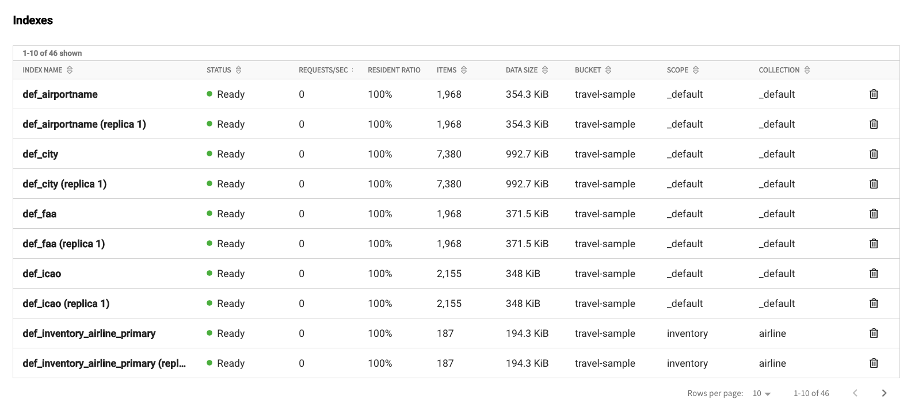
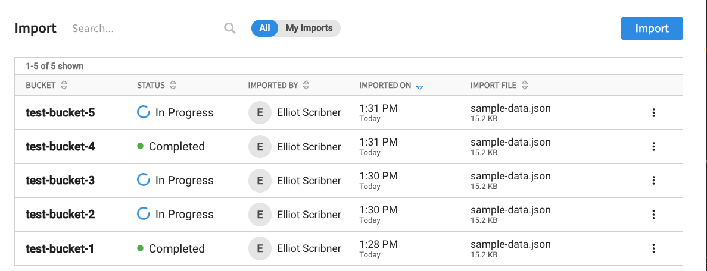
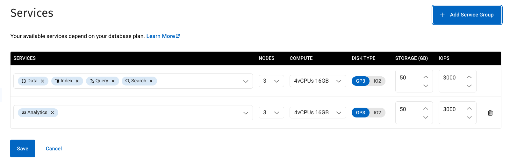

# Datagrids

A rough POC of several DataGrids using AG Grid Framework. Other grid frameworks will be tested in the near future.

## Indexes
The indexes table displays the indexes available for a given database with various metrics and details for each, as well as a "delete" button.

## Import
The import table displays a log of all data import operations, past and present, along with associated metadata for each import.

## Services
The services table is the most complex. It contains rows of service groups, each of which has a set of 1 or more services and several dropdowns and other controls to configure the service group.

### Notes
- We display data displayed in each table, either imported from one of the JSON files in `src/datagrids/data/`, or hard coded in the component itself.
- We defined child components in their parents `.tsx` file rather than creating many separate components for building CellRenderer's. The exception is `src/components/toggle.tsx`,
- The type checking is loose. In order to move quickly on this POC, `any` and `// @ts-ignore` are used more than they should be. Significant cleanup of code quality required.
- The tailwind config has been modified to fit the required brandkit. **Prefer using tailwind classes whenever possible.**
- **[Preview the live datagrids here](https://datagrids.vercel.app/)**
